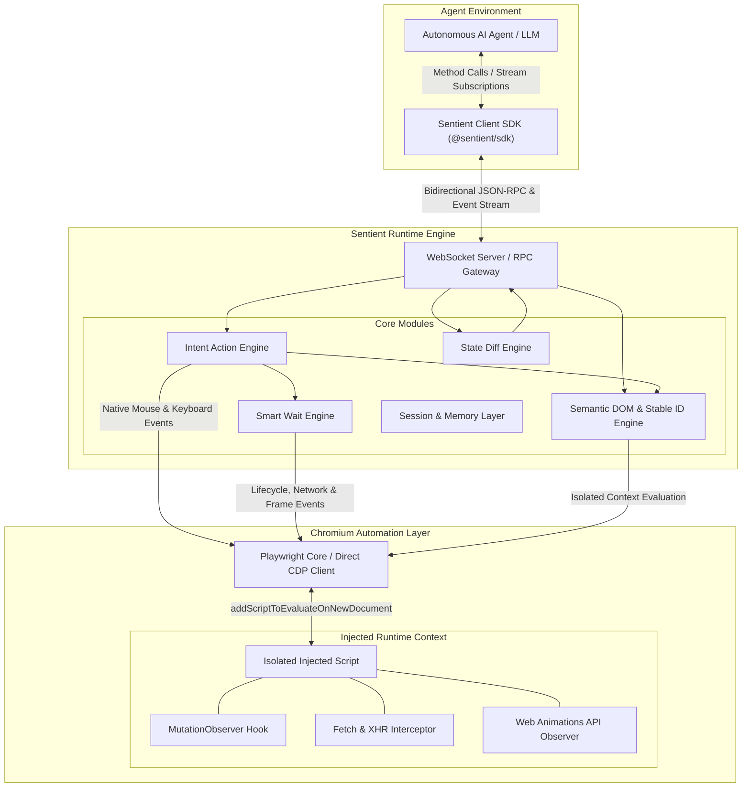
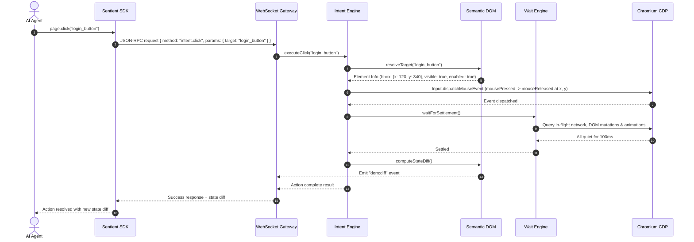

# Sentient Browser: Architecture Overview

This document describes the architectural design, component boundaries, and data flows of **Sentient Browser**, an AI-native browser runtime.

---

## 1. High-Level System Architecture

---

## 2. Core Architectural Components

### 2.1. Chromium Manager & CDP Controller (`@sentient/core/browser`)
* **Role**: Manages the lifecycle of Chromium processes and browser contexts.
* **Key Responsibilities**:
  * Spawns Chromium using `chromium_headless_shell` or standard headless/headful mode.
  * Creates isolated browser contexts (`BrowserContext`) for distinct agent tasks with fresh cookies, storage, and proxy settings.
  * Establishes low-level Chrome DevTools Protocol (CDP) sessions (`Target.attachToTarget`) to enable direct execution of commands without standard automation overhead.
  * Injects the runtime helper script into every document via `Page.addScriptToEvaluateOnNewDocument`.

---

### 2.2. Injected Runtime Context (`@sentient/core/browser/injected`)
* **Role**: A lightweight script running within the browser page in an **isolated JavaScript world**.
* **Key Responsibilities**:
  * **Isolation**: Cannot be detected, modified, or polluted by the target website's scripts.
  * **Mutation Observer**: Buffers DOM additions, removals, attribute mutations, and text changes.
  * **Network Interception**: Monkey-patches `window.fetch` and `window.XMLHttpRequest` inside the page to track in-flight requests in real time without heavy network proxy overhead.
  * **Animation & Rendering Tracking**: Checks running Web Animations (`document.getAnimations()`) and registers `requestAnimationFrame` ticks.
  * **Geometry & Visibility**: Performs accurate bounding box, occlusion checks (`document.elementFromPoint`), and computed visibility evaluation.

---

### 2.3. Semantic DOM & Stable ID Engine (`@sentient/core/semantic`)
* **Role**: Transforms noisy raw HTML into a clean, concise, token-efficient semantic tree.
* **Key Responsibilities**:
  * **Pruning Noise**: Filters out non-interactive wrappers (`div`, `span`, `section`), decorative SVGs, hidden elements (`display: none`, `visibility: hidden`, `aria-hidden="true"`), and empty elements.
  * **Semantic Representation**: Emits structured nodes featuring `id`, `role`, `text`, `value`, `clickable`, `enabled`, `focused`, `bbox`, and parent hierarchy.
  * **Deterministic Stable IDs**: Generates stable, human-readable slugs (`login_button`, `email_input`, `cart_count`) based on element role, accessible name, and container context. Dynamic hash-based IDs (e.g., `#btn-928374`) are replaced with semantic identifiers that persist across framework re-renders.

---

### 2.4. Incremental State Diff Engine (`@sentient/core/diff`)
* **Role**: Minimizes LLM token consumption by computing and streaming deltas between browser states.
* **Key Responsibilities**:
  * Maintains an in-memory snapshot of the previous semantic tree.
  * Compares current semantic state against previous snapshot using Stable IDs as keys.
  * Produces atomic mutation operations:
    * `NODE_ADDED`: New interactive element or modal appeared.
    * `NODE_REMOVED`: Loading indicator dismissed, banner closed.
    * `NODE_UPDATED`: Button enabled/disabled, text changed, input value filled.
  * Generates both structured JSON diffs and a one-line LLM string representation (e.g. `[DIFF] + Modal "Confirm Order" | - Spinner | ~ Button "Submit" (enabled: true)`).
  * Achieves **70% to 95% token savings** compared to resending the DOM.

---

### 2.5. Smart Waiting Engine (`@sentient/core/wait`)
* **Role**: Guarantees deterministic settlement of the page before returning control to the agent, eliminating flaky `sleep(ms)` calls.
* **Key Responsibilities**:
  * Multi-signal settlement evaluation:
    1. **Network Idle**: Active in-flight requests count is zero for at least 100ms.
    2. **DOM Mutation Silence**: No DOM additions or attribute changes for 100ms.
    3. **Animations Complete**: Zero running CSS animations or Web Animations API entries.
    4. **Frame Rendering Flush**: RAF (`requestAnimationFrame`) and idle cycles have completed.
    5. **Framework Hooks**: Checks React DevTools commit hook or framework idle flags when present.
  * Configurable timeouts with diagnostic error reporting (pinpoints which network request or animation blocked settlement).

---

### 2.6. Intent Action Engine (`@sentient/core/intent`)
* **Role**: Translates natural agent goals into reliable, low-level CDP dispatch events.
* **Key Responsibilities**:
  * Supports high-level intent actions: `click`, `doubleClick`, `fill`, `type`, `hover`, `select`, `check`, `scroll`.
  * **Target Resolution**: Matches targets by Stable ID, accessible name, exact text, or fuzzy semantic match.
  * **Pre-Flight Pipeline**:
    1. Resolve target element.
    2. Verify element is visible, non-zero-sized, and enabled.
    3. Smoothly scroll into viewport if off-screen.
    4. Verify element is not occluded by an overlay or sticky banner.
  * **Native CDP Dispatch**: Dispatches native mouse/keyboard events (`Input.dispatchMouseEvent`, `Input.dispatchKeyEvent`) rather than synthetic JavaScript `.click()` calls. This ensures event coordinates, bubbling, focus, and anti-bot verification pass reliably.
  * **Post-Action Auto-Wait**: Automatically triggers the Smart Wait Engine after action execution to ensure subsequent state changes have settled before returning.

---

### 2.7. Event Stream & WebSocket Server (`@sentient/core/server`)
* **Role**: Provides the bidirectional gateway for AI agents to connect to the runtime.
* **Key Responsibilities**:
  * Exposes JSON-RPC 2.0 endpoints for synchronous commands (`goto`, `click`, `getSemanticDOM`).
  * Provides WebSocket PubSub event streaming:
    * `page:loaded`
    * `dom:diff`
    * `dom:modal_opened`
    * `network:idle`
    * `action:started` / `action:completed`
  * Allows multiple agents or observer tools (like the Sentient Web Inspector) to connect concurrently.

---

### 2.8. Sentient Agent SDKs (`@sentient/sdk` & `packages/sdk-python`)
* **Role**: The clean, ergonomic client libraries imported by AI agent frameworks (Node.js & Python).
* **Key Responsibilities**:
  * **TypeScript**: Async/await methods, PubSub diff and agent step subscriptions (`@sentient/sdk`).
  * **Python**: Dual `SentientClient` (asyncio) and `SyncSentientClient` (blocking scripts / Jupyter notebooks / LangChain / CrewAI).
  * Strong typing for semantic nodes, snapshots, state diffs, and planner results.

---

### 2.9. Autonomous Goal Planner (`@sentient/core/agent`)
* **Role**: Orchestrates autonomous goal resolution directly from natural language objectives.
* **Key Responsibilities**:
  * Evaluates current pruned Semantic DOM against objective.
  * Reasons about candidate elements using semantic weights, synonym matching, and context heuristics (with zero external API key requirements).
  * Supports custom LLM callers (`llmCaller: (prompt) => Promise<string>`) for complex multi-step reasoning.
  * Tracks step progress, handles stuck-loop detection, and executes self-healing rollbacks on dead ends.

---

### 2.10. Action Journal & Rollback Engine (`@sentient/core/intent/history`)
* **Role**: Maintains a reversibility stack for browser interactions.
* **Key Responsibilities**:
  * Logs inverse operations for executed actions:
    * `fill`: Preserves previous input value and restores it on rollback.
    * `goto` / navigation: Dispatches browser back navigation.
    * `click` (modals/popups): Emits `Escape` key events to dismiss overlays.
  * Enables agents to explore risky interactions with instant undo guarantees.

---

## 3. End-to-End Action Execution Flow

The sequence diagram below illustrates how an agent's `page.click("login_button")` request is processed through the entire stack:

---

## 4. Performance & Latency Budgets

| Operation | Target Latency | Notes |
| :--- | :--- | :--- |
| **Target Resolution** | `< 10 ms` | Uses in-memory cached semantic map |
| **CDP Input Dispatch** | `< 15 ms` | Direct protocol message via WebSocket |
| **Wait Settlement (Quiet Page)** | `~100 ms` | Configurable debounce window |
| **Semantic DOM Extraction** | `< 30 ms` | Evaluated in isolated JS world |
| **Incremental Diff Calculation** | `< 10 ms` | Hash-set comparison of stable IDs |
| **Total Action Roundtrip** | `< 250 ms` | From SDK call to response with state diff |
