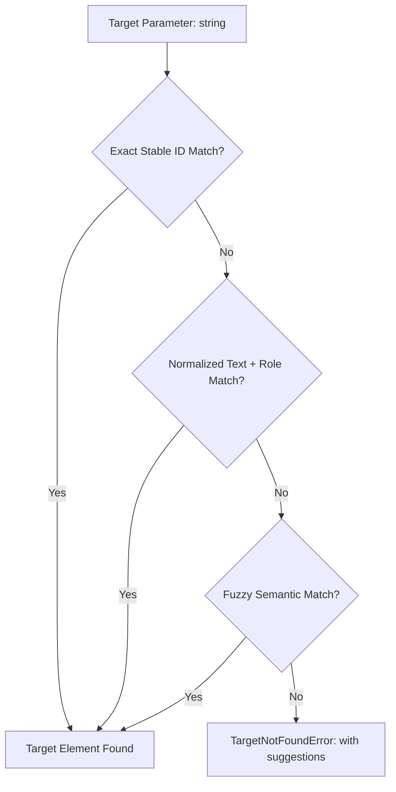

# Specification: Intent API & Action Engine

This document specifies the **Intent Action Engine** in Sentient Browser, detailing how natural agent instructions are resolved, verified, and executed as trusted native browser events.

---

## 1. Design Principles

1. **No Brittle Selectors**: The agent interacts with targets using **Stable IDs**, accessible text, or semantic roles (e.g. `page.click("login_button")` or `page.click("Log In")`), never XPath or fragile CSS class paths like `div > button:nth-child(2)`.
2. **Self-Healing & Auto-Recovery**: The engine automatically handles scrolling elements into the viewport, waiting for animations to complete, and detecting occluding overlays.
3. **Native Trusted Events**: Actions are dispatched via low-level Chrome DevTools Protocol (`Input.dispatchMouseEvent`, `Input.dispatchKeyEvent`). This guarantees that `event.isTrusted === true`, preventing anti-bot blocks and triggering framework event loops properly.
4. **Automatic Post-Action Settlement**: Every mutation action triggers the **Smart Wait Engine** automatically before resolving, ensuring the agent always observes settled state.

---

## 2. API Method Definitions

### 2.1. Navigation & Tab Management

```typescript
interface NavigationOptions {
  timeoutMs?: number;      // Default: 30000ms
  waitUntil?: 'load' | 'domcontentloaded' | 'networkidle' | 'settled'; // Default: 'settled'
}

interface Page {
  /** Navigate to URL and wait until the page state is settled */
  goto(url: string, options?: NavigationOptions): Promise<SemanticSnapshot>;

  /** Reload current page */
  reload(options?: NavigationOptions): Promise<SemanticSnapshot>;

  /** Go back in history */
  back(): Promise<SemanticSnapshot>;

  /** Go forward in history */
  forward(): Promise<SemanticSnapshot>;

  /** Close current page */
  close(): Promise<void>;

  /** Open a new tab */
  openTab(url?: string): Promise<Page>;

  /** Switch active tab */
  switchTab(tabId: string): Promise<Page>;

  /** List all active tabs with summary titles and URLs */
  listTabs(): Promise<TabSummary[]>;
}
```

---

### 2.2. Interactive Actions

```typescript
interface ClickOptions {
  button?: 'left' | 'right' | 'middle'; // Default: 'left'
  clickCount?: number;                   // 1 for single, 2 for double click
  modifiers?: ('Alt' | 'Control' | 'Meta' | 'Shift')[];
  timeoutMs?: number;                    // Default: 10000ms
}

interface FillOptions {
  clearFirst?: boolean;                  // Default: true
  pressEnterAfter?: boolean;             // Default: false
  timeoutMs?: number;                    // Default: 10000ms
}

interface ScrollOptions {
  direction?: 'up' | 'down' | 'top' | 'bottom';
  amountPx?: number;                     // Default: 500px for up/down
  target?: string;                       // Scroll specific element into view
}

interface PageInteraction {
  /** Click an element by Stable ID, role, or text */
  click(target: string, options?: ClickOptions): Promise<StateDiff>;

  /** Double click an element */
  doubleClick(target: string, options?: ClickOptions): Promise<StateDiff>;

  /** Hover mouse over element */
  hover(target: string): Promise<StateDiff>;

  /** Fill input/textarea with text (clears first, types natively, triggers change event) */
  fill(target: string, text: string, options?: FillOptions): Promise<StateDiff>;

  /** Sequentially type characters simulating human keystrokes */
  type(target: string, text: string, options?: { delayMs?: number }): Promise<StateDiff>;

  /** Select dropdown option by text or value */
  select(target: string, value: string): Promise<StateDiff>;

  /** Check a checkbox or radio button */
  check(target: string): Promise<StateDiff>;

  /** Uncheck a checkbox */
  uncheck(target: string): Promise<StateDiff>;

  /** Scroll the viewport or target element */
  scroll(options: ScrollOptions): Promise<StateDiff>;

  /** Upload files to a file input */
  upload(target: string, filePaths: string[]): Promise<StateDiff>;
}
```

---

### 2.3. Observation & State Querying

```typescript
interface PageObservation {
  /** Returns the full structured Semantic DOM */
  getSemanticDOM(): Promise<SemanticSnapshot>;

  /** Returns latest incremental state diff since last action */
  getDiff(): Promise<StateDiff>;

  /** Wait for a specific condition, Stable ID, or text to appear */
  waitFor(condition: string | { target: string; state?: 'visible' | 'clickable' | 'hidden' }, options?: { timeoutMs?: number }): Promise<void>;

  /** Subscribe to real-time events */
  on(event: 'diff' | 'modal' | 'networkIdle', callback: (payload: any) => void): void;
}
```

---

## 3. Target Resolution Pipeline

When an agent passes a target parameter like `"login_button"` or `"Log In"`, the Intent Engine resolves the actual element using a 3-tier matching pipeline:



### 3.1. Tier 1: Exact Stable ID Match
* Direct lookup in the cached semantic node map by `node.id`.
* Example: `page.click("submit_payment_button")` matches node with id `"submit_payment_button"`.
* Resolution time: `< 1ms`.

### 3.2. Tier 2: Normalized Text & Role Match
* If no exact ID match, check if target contains `role:text` or pure text:
  * `"button:Checkout"`
  * `"Checkout"` -> matches `<button>Proceed to Checkout</button>`
* Matches case-insensitively with punctuation stripped.

### 3.3. Tier 3: Fuzzy Semantic Match
* If exact text fails, calculates Levenshtein distance and token containment against interactive elements.
* Example: `"Sign in"` matches a button labeled `"Sign In to Your Account"`.
* If ambiguous (multiple strong matches), raises a clear disambiguation error:
  `AmbiguousTargetError: Found 2 matching elements: 'add_to_cart_macbook_pro', 'add_to_cart_ipad_air'. Please specify Stable ID.`

---

## 4. Pre-Flight Safety Pipeline

Before dispatching any click or keyboard event, the Intent Engine runs safety checks:

1. **Visibility Check**:
   * Evaluates `getComputedStyle(el)`.
   * Checks `display !== 'none'`, `visibility !== 'hidden'`, `opacity > 0.05`.
   * Checks `el.offsetWidth > 0 && el.offsetHeight > 0`.
2. **Scroll-Into-View**:
   * If element bounding box is outside current viewport, automatically scrolls it smoothly into center:
     `el.scrollIntoView({ block: 'center', inline: 'center', behavior: 'instant' })`.
3. **Occlusion & Backdrop Check**:
   * Runs `document.elementFromPoint(centerX, centerY)`.
   * Verifies that the element at the target coordinates is the element itself or one of its child nodes.
   * If a modal backdrop, cookie consent banner, or sticky popup occludes the element, the engine detects the blocker and reports:
     `ElementOccludedError: Target 'submit_btn' is occluded by 'cookie_consent_modal'.`

---

## 5. Native CDP Event Dispatching

Unlike standard browser extensions that call `element.click()` (synthetic JS event), Sentient Browser uses Chrome DevTools Protocol native input events:

```typescript
// Click implementation via CDP
const centerX = bbox.x + bbox.width / 2;
const centerY = bbox.y + bbox.height / 2;

// 1. Move mouse to target
await cdpSession.send('Input.dispatchMouseEvent', {
  type: 'mouseMoved',
  x: centerX,
  y: centerY,
});

// 2. Press mouse button
await cdpSession.send('Input.dispatchMouseEvent', {
  type: 'mousePressed',
  x: centerX,
  y: centerY,
  button: 'left',
  clickCount: 1,
});

// 3. Release mouse button
await cdpSession.send('Input.dispatchMouseEvent', {
  type: 'mouseReleased',
  x: centerX,
  y: centerY,
  button: 'left',
  clickCount: 1,
});
```

### Why Native CDP Input is Essential:
1. **Trusted Events (`isTrusted = true`)**: Modern fraud prevention (Cloudflare Turnstile, reCAPTCHA, Google Auth) rejects synthetic `.click()` events. Native CDP events are indistinguishable from human user clicks.
2. **True Visual Coordinates**: Clicks occur at actual screen coordinates, testing CSS pseudo-classes (`:hover`, `:active`) and visual layout.
3. **Full Event Lifecycle**: Automatically triggers `mouseenter`, `mouseover`, `mousedown`, `focus`, `mouseup`, and `click` in the exact browser-native order.
