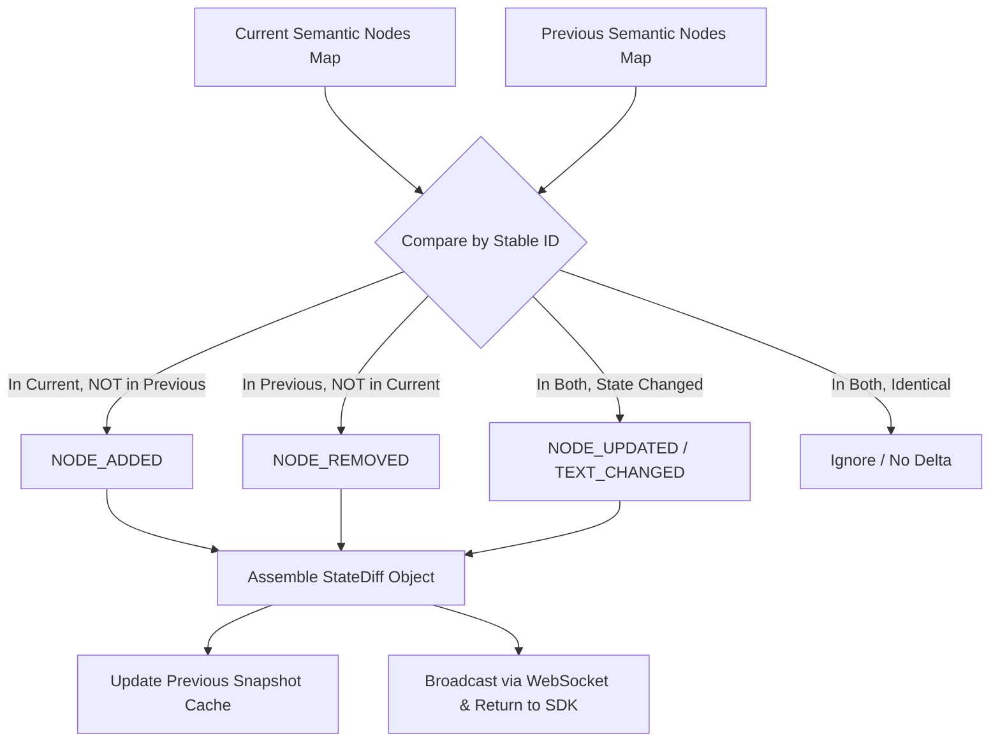

# Specification: Incremental State Diff & Event Stream

This document defines the **Incremental State Diff Engine** and the **WebSocket Event Protocol** in Sentient Browser, providing real-time, token-minimal updates to autonomous AI agents.

---

## 1. Why Incremental State Diffing?

Even with a pruned Semantic DOM (200–1,000 tokens), resending the entire state on every single click or keystroke accumulates rapidly in a multi-step agent session:

* **Full DOM Snapshots (10 steps)**: `1,000 tokens × 10 steps = 10,000 tokens`
* **Incremental State Diffs (10 steps)**: `1,000 tokens (initial) + (50 tokens × 9 steps) = 1,450 tokens`

This yields an **85.5% token reduction** across a typical workflow, speeding up LLM reasoning and cutting inference costs significantly.

---

## 2. State Diff Data Model

### 2.1. TypeScript Interface

```typescript
export type DiffOperationType =
  | 'NODE_ADDED'
  | 'NODE_REMOVED'
  | 'NODE_UPDATED'
  | 'TEXT_CHANGED'
  | 'VALUE_CHANGED';

export interface NodeDelta {
  operation: DiffOperationType;
  nodeId: string;
  role: string;
  text?: string;
  changes?: Record<string, { from: any; to: any }>;
  node?: SemanticNode; // Present for NODE_ADDED
}

export interface StateDiff {
  id: string;
  timestamp: number;
  url: string;
  title: string;
  operationsCount: number;
  deltas: NodeDelta[];

  /** Serializes the diff into a token-efficient string designed for LLMs */
  toCompactString(): string;
}
```

---

### 2.2. Structured JSON Example

```json
{
  "id": "diff_01h8k29a",
  "timestamp": 1726912300120,
  "url": "https://example.com/checkout",
  "title": "Checkout",
  "operationsCount": 3,
  "deltas": [
    {
      "operation": "NODE_REMOVED",
      "nodeId": "loading_spinner",
      "role": "indicator",
      "text": "Calculating shipping..."
    },
    {
      "operation": "NODE_ADDED",
      "nodeId": "shipping_method_dropdown",
      "role": "select",
      "node": {
        "id": "shipping_method_dropdown",
        "role": "select",
        "text": "Standard Shipping ($4.99)",
        "enabled": true,
        "clickable": true
      }
    },
    {
      "operation": "NODE_UPDATED",
      "nodeId": "pay_button",
      "role": "button",
      "changes": {
        "enabled": { "from": false, "to": true },
        "text": { "from": "Pay ($0.00)", "to": "Pay ($54.98)" }
      }
    }
  ]
}
```

---

### 2.3. LLM Compact String Format (`toCompactString`)

Instead of parsing full JSON objects, an LLM prompt can consume this human-readable, token-dense representation:

```text
[STATE DIFF]
- REMOVED: indicator "loading_spinner" (Calculating shipping...)
+ ADDED:   select "shipping_method_dropdown" ("Standard Shipping ($4.99)") [enabled, clickable]
~ UPDATED: button "pay_button" [enabled: false -> true, text: "Pay ($0.00)" -> "Pay ($54.98)"]
```

> **Token Count**: Only **48 tokens** to describe a major dynamic page transition!

---

## 3. Diffing Algorithm



1. **Key Indexing**: Nodes are indexed in memory by their deterministic `StableId`.
2. **Added Elements**: Any key present in the new snapshot but absent in the previous snapshot is emitted as `NODE_ADDED`.
3. **Removed Elements**: Any key present in the previous snapshot but absent in the new snapshot is emitted as `NODE_REMOVED`.
4. **Mutated Elements**: For keys present in both:
   * Shallow comparison of properties: `text`, `value`, `enabled`, `clickable`, `visible`, `focused`, `checked`.
   * If any property changed, record `{ from, to }` in `NODE_UPDATED`.
5. **No-Op Pruning**: If the DOM mutation did not affect any interactive or semantic elements (e.g. internal React fiber updates or non-visible wrapper class changes), the diff produces an empty delta list and does not trigger an LLM turn.

---

## 4. WebSocket Event Stream Protocol

Sentient Browser exposes a bidirectional JSON-RPC 2.0 interface and PubSub event stream over WebSocket (default port: `9222` or configurable).

### 4.1. Server-Sent Event Payloads

#### Event: `dom:diff`
Emitted whenever page mutations settle following user actions or asynchronous background data loading:
```json
{
  "jsonrpc": "2.0",
  "method": "event.domDiff",
  "params": {
    "pageId": "tab_01",
    "diff": {
      "id": "diff_01h8k29a",
      "deltas": [ ... ],
      "compact": "[STATE DIFF]\n+ ADDED: modal \"order_success_modal\"..."
    }
  }
}
```

#### Event: `dom:modal_opened`
Emitted immediately when a dialog, alert, or modal overlay appears:
```json
{
  "jsonrpc": "2.0",
  "method": "event.modalOpened",
  "params": {
    "pageId": "tab_01",
    "modalId": "confirm_checkout_dialog",
    "title": "Confirm Order",
    "dismissible": true
  }
}
```

#### Event: `page:navigated`
Emitted when the browser URL changes:
```json
{
  "jsonrpc": "2.0",
  "method": "event.pageNavigated",
  "params": {
    "pageId": "tab_01",
    "url": "https://example.com/receipt/92834",
    "title": "Order Receipt #92834"
  }
}
```

---

### 4.2. Client RPC Commands

Agents can issue RPC commands over the same WebSocket:

```json
{
  "jsonrpc": "2.0",
  "id": 101,
  "method": "intent.click",
  "params": {
    "pageId": "tab_01",
    "target": "checkout_button"
  }
}
```

Response:
```json
{
  "jsonrpc": "2.0",
  "id": 101,
  "result": {
    "status": "success",
    "diff": {
      "id": "diff_01h8k29b",
      "deltas": [ ... ],
      "compact": "[STATE DIFF]\n+ ADDED: modal \"payment_modal\""
    }
  }
}
```
