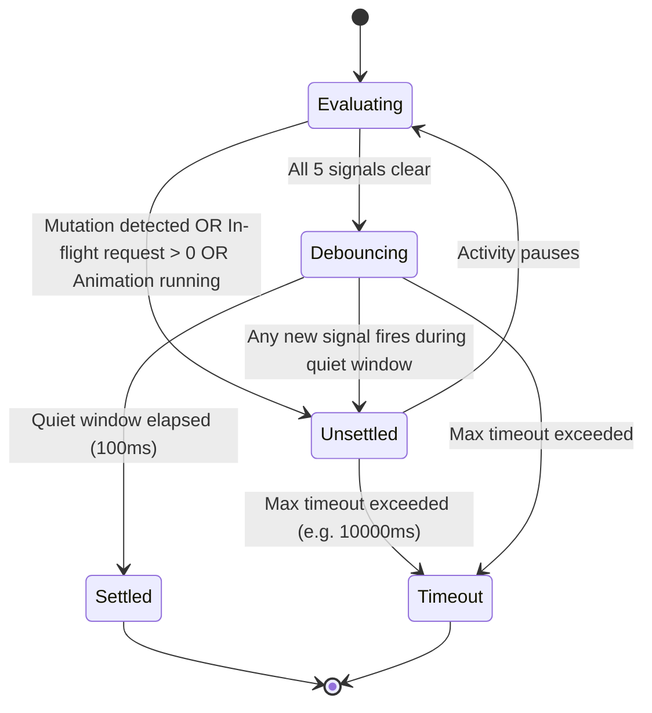

# Specification: Smart Wait Engine

This document defines the **Smart Wait Engine** in Sentient Browser, detailing the multi-signal readiness detection algorithm that eliminates arbitrary `sleep()` calls and flaky tests.

---

## 1. Why Traditional Waiting Fails

| Traditional Approach | Why It Fails in Modern Web Apps |
| :--- | :--- |
| **`sleep(3000)`** | Brittle, arbitrary, and either wastes seconds when the page was ready in 200ms or fails when a network request takes 3100ms. |
| **`waitForSelector("#submit")`** | In modern React/Vue/Angular apps, an element is frequently attached to the DOM *before* its JavaScript event listeners are hydrated, leading to "click didn't do anything" failures. |
| **CDP `networkidle0`** | Modern SPAs constantly run long-polling, WebSockets, analytics pings, or background data fetching that prevent in-flight network requests from ever reaching zero. |

The **Smart Wait Engine** replaces these broken strategies with **deterministic multi-signal settlement**.

---

## 2. The 5 Pillars of Settlement

A page state is considered **settled** when all five conditions below are satisfied simultaneously:

```
                  ┌────────────────────────────────────────────────────────┐
                  │                 Smart Wait Engine                     │
                  └──────────────────────────┬─────────────────────────────┘
                                             │
      ┌──────────────────┬───────────────────┼───────────────────┬──────────────────┐
      │                  │                   │                   │                  │
┌─────▼────────┐  ┌──────▼───────┐  ┌────────▼────────┐  ┌───────▼────────┐  ┌──────▼───────┐
│ 1. Network   │  │ 2. DOM       │  │ 3. CSS/Web      │  │ 4. Frame       │  │ 5. Framework │
│ Quiet Window │  │ Silence      │  │ Animations      │  │ Flush (RAF)    │  │ Lifecycle    │
│ (In-flight=0)│  │ (0 mutations)│  │ (0 active anims)│  │ (2 RAF cycles) │  │ (React/Vue)  │
└──────────────┘  └──────────────┘  └─────────────────┘  └────────────────┘  └──────────────┘
```

### Pillar 1: Network In-Flight Counter (Quiet Window)
* The injected runtime intercepts `window.fetch` and `window.XMLHttpRequest`.
* Maintains an active request counter:
  * Incremented on request initiation.
  * Decremented on request response, failure, or timeout.
  * Excludes background streaming endpoints, long-polling, WebSockets, and known analytics tracking (Google Analytics, Mixpanel, Datadog).
* **Requirement**: Active meaningful network requests must equal `0` continuously for the configured quiet duration (default: `100ms`).

### Pillar 2: DOM Mutation Silence
* A `MutationObserver` instance attaches to `document.documentElement` with `{ childList: true, subtree: true, attributes: true, characterData: true }`.
* Any mutation resets the settlement timer.
* **Requirement**: Zero DOM mutations for at least `100ms`.

### Pillar 3: Web Animations Completion
* The engine queries the browser's Web Animations API:
  ```javascript
  const activeAnimations = document.getAnimations().filter(a => {
    return a.playState === 'running' && a.effect && a.effect.getComputedTiming().iterations !== Infinity;
  });
  ```
* Infinite looping animations (e.g. skeleton loading pulses or continuous rotating spinners) are classified as non-blocking.
* **Requirement**: Zero active non-infinite CSS transitions or keyframe animations running.

### Pillar 4: Rendering Frame Flush (Double RAF)
* Ensures that the browser's layout, style recalculation, and compositor layers have executed and painted.
* **Requirement**: Two consecutive `requestAnimationFrame` ticks complete followed by a `requestIdleCallback` or immediate microtask resolution:
  ```javascript
  await new Promise(resolve => requestAnimationFrame(() => requestAnimationFrame(resolve)));
  ```

### Pillar 5: Frontend Framework Lifecycle Hooks
* When detected on the page, the engine inspects framework-specific idle indicators:
  * **React 18 / 19**: Checks `window.__REACT_DEVTOOLS_GLOBAL_HOOK__` scheduler queue status if present.
  * **Vue 3**: Awaits `window.nextTick?.()` if exposed or checks reactive flush queue.
  * **Angular**: Checks `window.getAllAngularTestabilities?.()[0]?.isStable()`.

---

## 3. Settlement State Machine



---

## 4. Configurable Settlement Profiles

Different actions require different settlement sensitivity:

```typescript
export interface WaitOptions {
  timeoutMs?: number;       // Default: 10000ms
  quietWindowMs?: number;   // Default: 100ms
  profile?: 'eager' | 'default' | 'strict';
}
```

| Profile | Quiet Window | Checks Included | Ideal Use Case |
| :--- | :--- | :--- | :--- |
| **`eager`** | `50 ms` | Network + DOM silence only | Reading text, simple form typing, quick status checks |
| **`default`** | `100 ms` | All 5 Pillars | Standard button clicks, navigation, dropdown selections |
| **`strict`** | `300 ms` | All 5 Pillars + extended network stabilization | Full page navigations, payment submission, modal openings |

---

## 5. Diagnostic Timeout Reporting

When a wait operation times out, the engine does not throw a generic `TimeoutError`. It generates a rich, actionable diagnostic report explaining **exactly why** the page failed to settle:

```
WaitSettlementTimeoutError: Page failed to settle within 10000ms (profile: default).

Blocking Signals:
- In-Flight Network Requests (1 active):
  • POST https://api.example.com/checkout/calculate-tax (elapsed: 4200ms)
- Active DOM Mutations:
  • 2 mutations occurred in the last 40ms targeting: <div class="price-calculator">
- Running Animations:
  • 0 active animations

Recommendation: Check if the network backend is hanging, or use { profile: 'eager' } if background tax calculation is non-blocking.
```

This diagnostic report provides agents with immediate self-debugging context to adjust their plan or retry gracefully.
